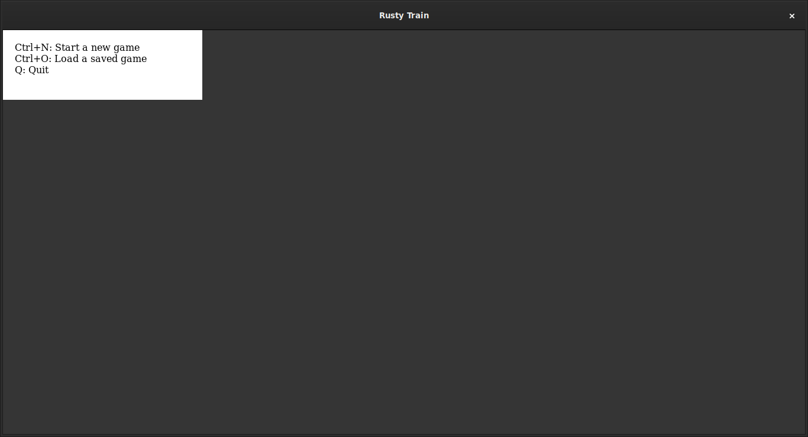
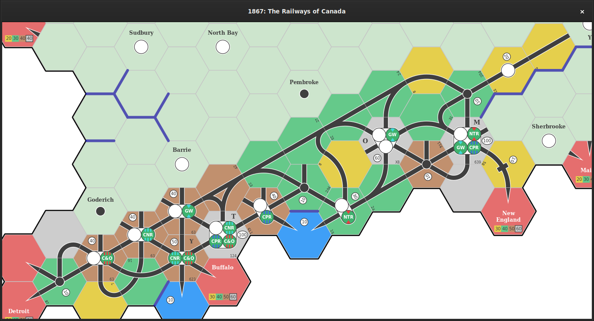
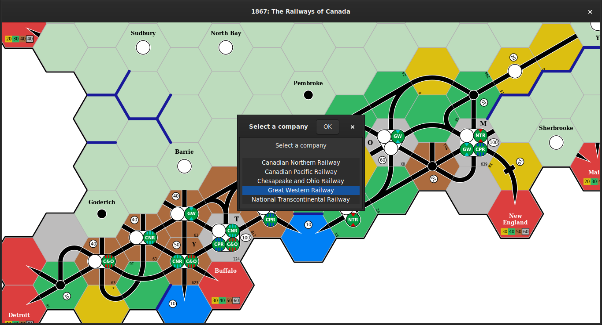
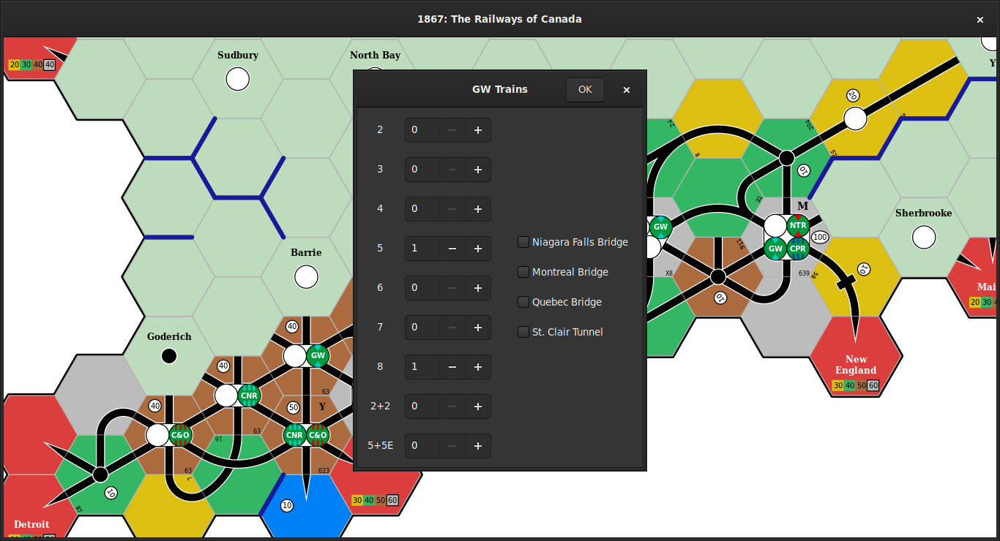
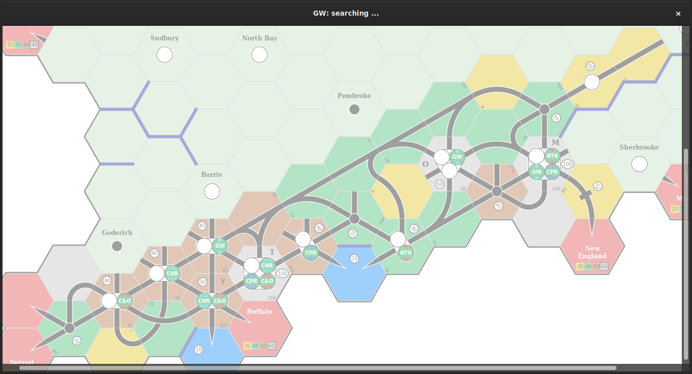
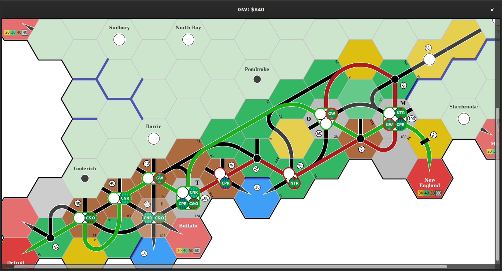
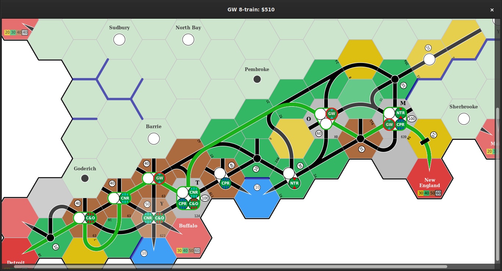
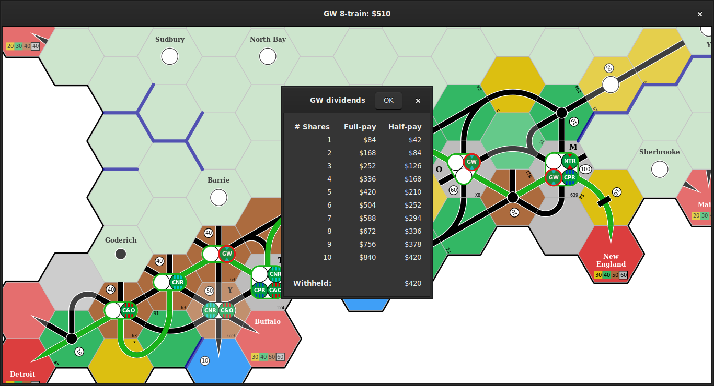

# Rusty Train

A graphical user interface for constructing 18xx maps and identifying optimal train routes.

## Example usage

Start Rusty Train with `cargo run --release`:

Load the `1867_bc` example game, which is in `./examples/output/1867_bc.game`, with `Ctrl+O`:

Press `r` to find the optimal routes for a company.
Select the **Great Western Railway** and click `OK`:

This company owns a `5-train` and an `8-train`, and does not receive any of the four bonuses listed on the right-hand side.
Enter these details and click `OK`:

The map is disabled and faded out while searching for the optimal routes:

When the optimal routes are found, they will be drawn on the map (highlighted in green and in red) and the net revenue is shown in the window title:

Use the arrow keys (`<Left>`, `<Right>`, `<Up>`, `<Down>`) to cycle through the individual routes; the train name and route revenue are shown in the window title:

Press `d` to display the dividend payments:

Press `Esc` or `Return` to return to the default user interface
mode.

## User guide

There are four different user interface **modes**:

- **Default:** select and rotate tiles, switch to other modes.
- **Replace tile:** place and upgrade tiles.
- **Edit tokens:** place and remove tokens from a tile.
- **Find routes:** identify the optimal routes and revenue for a company.

Each mode responds to different key combinations (see sections below).

There are also global keys that perform the same action in any mode:

| Key                | Action                               |
|--------------------|--------------------------------------|
| `q`, `Q`           | Quit                                 |
| `s`, `S`           | Save a screenshot of the current map |
| `Ctrl+n`, `Ctrl+N` | Start a new game                     |
| `Ctrl+o`, `Ctrl+O` | Load a saved game from disk          |
| `Ctrl+s`, `Ctrl+S` | Save the current game to disk        |
| `+`                | Zoom in                              |
| `-`                | Zoom out                             |

### Default mode

Use this mode to select a tile or hex space, and switch to other modes to place tiles, place tokens, and select optimal routes.

| Key              | Action                                                      |
|------------------|-------------------------------------------------------------|
| `e`, `E`         | Switch to **Replace tile** mode, select **any** tile        |
| `u`, `U`         | Switch to **Replace tile** mode, select an **upgrade** tile |
| `t`, `T`         | Switch to **Edit tokens** mode                              |
| `r`, `R`         | Switch to **Find routes** mode                              |
| `<Left>`         | Select the hex on the left of the current hex               |
| `<Right>`        | Select the hex on the right of the current hex               |
| `<Up>`           | Select the hex above the current hex                        |
| `<Down>`         | Select the hex below the current hex                        |
| Any mouse button | Select the hex under the cursor                             |
| `,`, `<`         | Rotate the current tile anti-clockwise                      |
| `.`, `>`         | Rotate the current tile clockwise                           |
| `<Backspace>`    | Remove the current tile                                     |
| `<Delete>`       | Remove the current tile                                     |
| `p`, `P`         | Change the game phase                                       |

### Replace tile mode

Use this mode to place and upgrade tiles.

| Key      | Action                                         |
|----------|------------------------------------------------|
| `Esc`    | Return to **Default** mode, ignoring any edits |
| `Return` | Return to **Default** mode, saving any edits   |
| `o`, `O` | Show the original tile, if any                 |
| `<Up>`   | Select the next available tile                 |
| `<Down>` | Select the previous available tile             |
| `,`, `<` | Rotate the selected tile anti-clockwise        |
| `.`, `>` | Rotate the selected tile clockwise             |

### Edit tokens mode

Use this mode to place and remove tokens from a tile.

| Key           | Action                                                               |
|---------------|----------------------------------------------------------------------|
| `Esc`         | Return to **Default** mode, ignoring any edits                       |
| `Return`      | Return to **Default** mode, saving any edits                         |
| `<Left>`      | Select the previous token on the active tile                         |
| `<Right>`     | Select the next token on the active tile                             |
| `<Up>`        | Replace the current token (if any) with the next available token     |
| `<Down>`      | Replace the current token (if any) with the previous available token |
| `0`           | Remove the current token                                             |
| `<Delete>`    | Remove the current token                                             |
| `<Backspace>` | Remove the current token                                             |

### Find routes mode

Use this mode to select a company and find the optimal routes and revenue for this company.

The user will be prompted to select one of the companies that has placed tokens on the map.
They will then be prompted to select the trains available to this company, and any relevant bonuses.

This will initiate the route-finding process; depending on the number of potential routes, **this may take several minutes to complete**.

The optimal routes will then be drawn on the map and the optimal revenue will be displayed.
The user can cycle through the individual routes with the arrow keys.

| Key                 | Action                        |
|---------------------|-------------------------------|
| `Esc`, `Return`     | Return to **Default** mode    |
| `<Left>`, `<Up>`    | Show the previous train route |
| `<Right>`, `<Down>` | Show the next train route     |

## Supported games

Maps, tiles, and trains for the following games are implemented:

- 1830: Railways and Robber Barons
- 1861: The Railways of the Russian Empire
- 1867: The Railways of Canada

## License

Licensed under either of

* Apache License, Version 2.0 ([LICENSE-APACHE](LICENSE-APACHE) or http://www.apache.org/licenses/LICENSE-2.0)
* MIT license ([LICENSE-MIT](LICENSE-MIT) or http://opensource.org/licenses/MIT)

at your option.

## Contribution

Unless you explicitly state otherwise, any contribution intentionally submitted for inclusion in the work by you, as defined in the Apache-2.0 license, shall be dual licensed as above, without any additional terms or conditions.
