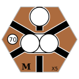
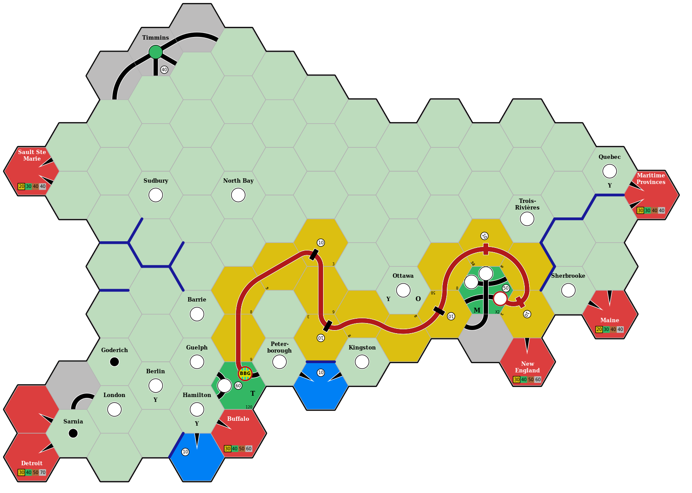

# 18xx introduction

18xx refers to a
[family of board games](https://boardgamegeek.com/wiki/page/18xx) that focus
on investing in, and operating, train companies.
Players can buy stock in companies, and the player who owns the most shares in
a company is responsible for operating the company.
Companies lay track by placing hexagonal tiles, and run trains along the track
network to earn revenue.
Dividends may then be paid to all players who own shares in the company.
Players aim to end the game with the most wealth, and this can be achieved in
a number of different ways.
Some games emphasise manipulating the stock market, while other games place a
greater emphasis on running profitable companies.

## Rusty Train

Rusty Train is a graphical user interface that uses the ``navig18xx`` crate to
allow users to track the state of 18xx game maps, and to calculate the optimal
revenue that each company can earn.

See the [user guide](./user_guide/index.html) for details.

## navig18xx

The ``navig18xx`` crate ("navigating ex ex") allows players to identify the
train routes that will earn the most revenue for a company.
It also provides lower-level building blocks for defining tiles and creating
game maps.

See the [developer guide](./dev_guide/index.html) for details.

## An example tile



This image was produced by the following code:

```rust,no_run,noplayground
{{#include ../../examples/tile_x5.rs}}
```

## An example route


