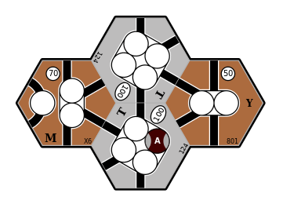
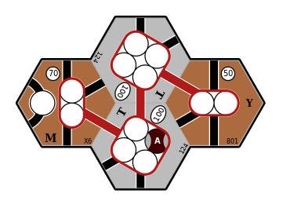

# Identifying optimal routes

We divide the process of identifying the optimal routes for a company to
operate into the following steps:

1. Identify all routes available to the company;

2. Identify all valid combinations of available routes;

3. Identify all valid pairings of trains to routes; and

4. Identify the optimal pairing of trains to routes.

We now describe each of these steps in turn.

**TODO:** include diagrams to illustrate each step.
Show, e.g.,:

- Multiple (conflicting and non-conflicting) routes starting from a single
  token;

- Joining paths;

- Path combinations;

- Multiple routes along the same path due to different skips/stops.

- Here is an example where the optimal routes for a pair of trains involves
  sub-optimal routes for each train:

  | Map                  | Description                          |
  |:--------------------:|--------------------------------------|
  |       | Four connected cities                |
  |     | 8-train: optimal revenue is $320     |
  |   | 2+2-train: optimal revenue is $400   |
  |  | Both trains: optimal revenue is $590 |

## Identifying all available routes

We assume that all routes operated by a company must pass through a city that
contains one of the company's token.

1. We first define the route limits, such as maximum number of stops, if any.

2. We then loop over all of the company's placed tokens and, for each placed
   token, construct all valid paths that **start at this token**.

3. To allow for paths that **pass through** a placed token, we form new paths
   by joining pairs of paths that both start at the same placed token, subject
   to the following constraints:

   - The two paths being joined do not have any conflicts (i.e., they don't
     have any elements in common except for the placed token); and

   - The combined path respects constraints on length, number of stops, etc.

4. To avoid duplicating paths that pass through more than one of the company's
   placed tokens, we:

   - Define an ordering on token spaces across the entire map, by representing
     each token space as a `(HexAddress, usize)` tuple, where `HexAddress`
     implements `Ord` and the `usize` element is the index of the token space
     on its tile.

   - When constructing paths that start at a placed token, we stop searching
     when another of the company's placed tokens is reached **and** according
     to the `(HexAddress, usize)` ordering this encountered token comes before
     (i.e., is less than) the starting token.

   This ensures that any connection between two of the company's placed tokens
   is only explored in a single (arbitrary, but consistent) direction.

   Note that this is sufficient to identify all valid paths.
   Each valid path will reach (or pass through) at least one placed token and,
   of these tokens, one will be the "minimum" token according to the
   `(HexAddress, usize)` ordering.
   This path will then be constructed by steps 2 and 3, above, when starting
   from this "minimum" token.

5. If the company owns any trains that can skip over towns and/or cities, we
   consider paths of arbitrary length, with the restriction that any train
   that operates this route:

   - Must stop at the first and last revenue centres; and

   - May skip over revenue centres in the middle of the route.

   Note that in this case, a single path represents **multiple routes** that
   traverse the same path, but where the train stops at a different subset of
   the available revenue centres.

## Identifying all valid combinations of routes

We need to consider all \\(k\\)-combinations of routes where there is at least
one route, but no more routes than the number of trains owned by the company.
That is, for a company that owns \\(T\\) trains, we need to consider all
\\(k\\)-combinations for each \\(k: 1 \le k \le T \\).

We also want to ignore any combination of routes where any of the routes
conflict with each other (e.g., by using the same track segment).
Note that by exploring all valid **combinations**, we ignore the **order** in
which routes are combined.

This is implemented by `n18route::comb::CombinationsFilter`, which internally
iterates over all route combinations and skips over combinations where any of
the routes conflict with each other.

## Identifying all valid pairings of trains to routes

We assume that the revenue earned from operating a route only depends on the
**train type**.
For example, if a company owns two `2` trains we do not need to consider the
order in which they are paired with routes, because the results will be
identical.

But for a given combination of routes &mdash; in which the routes will
necessarily be listed in a specific order &mdash; the order in which we
allocate train types to these routes **matters**.
For example, if there are two routes that visit exactly two cities and the
company owns a `2` train **and** a `2+2` train, the net revenue will be higher
if the `2+2` train operates the route that earns the greatest revenue.

So for a given (ordered) combination of \\(R\\) routes we need to explore all
of the \\(R\\)-permutations of the company's trains that are unique in their
ordering of **train types**.

This is implemented by `n18route::perm::KPermutationsFilter`, which internally
iterates over all train *k*-permutations and skips over permutations that
don't change the ordering of train types.

## Identifying the optimal combination of routes

Once we have collected all of the possible paths for a company, we need to
find the allocation of company trains to routes that yields the greatest
revenue.
There are a number of complications to consider:

1. For a given set of routes, the revenue may depend on how we allocate these
   routes to the company's trains.
   For example, if there are two routes that visit exactly two cities and the
   company owns a `2` train **and** a `2+2` train, the `2+2` train should run
   on the route that earns the greatest revenue.

2. We need to consider operating fewer routes than the company has trains.

3. For express trains, we must consider routes of all possible lengths, and
   determine the combination of visiting and skipping cities along each route
   that earns the greatest revenue.

   + So for an express train that can make up to `N` stops, it must stop at
     the first and last stops on the path, and up to `N - 2` stops anywhere
     else along the path.

   + Note that route bonuses may affect which of the `N - 2` stops earn the
     most revenue, so we need to evaluate **every combination** of stopping
     at, or skipping over, each revenue centre (except for the first and last
     centres, where the train must stop).

4. Routes may earn bonus revenue from a variety of sources, such as:

   + By owning private companies that provide bonus revenue when visiting a
     specific location.

   + By visiting a specific combination of cities.
     For example, in 1867 the city of Timmins normally earns $40, but if the
     route also includes at least one of Toronto, Montréal, or Québec, its
     revenue is doubled ($80).

   These bonuses are game-specific and context-dependent.
   The supported bonus types are defined by the `n18route::bonus::Bonus` enum.

**TODO:** haven't described all steps of the algorithm ...
