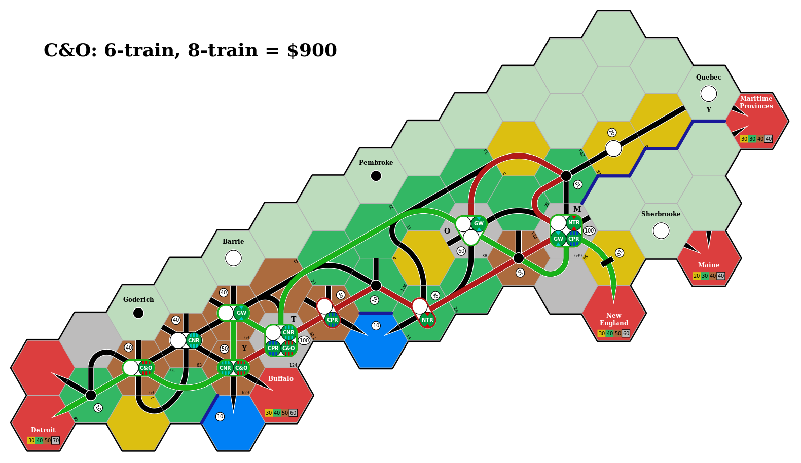

# Motivation

As someone who has enjoyed playing board games since 2010 or so, I began my own collection in 2016 when I felt it likely that I wouldn't relocate internationally in the near future.
At that point I wasn't aware of 18xx.

But as I continued to explore board games, I eventually came across 1830 and watched [the GameNight! team play 1830](https://www.youtube.com/watch?v=uLTFo-xb7ts).
At this point I became interested, and eventually stumbled across the [18Chesapeake Kickstarter campaign](https://www.kickstarter.com/projects/all-aboardgames/18chesapeake/).
I ultimately decided not to back 18Chesapeake, and then I saw the [1861/67 Kickstarter campaign](https://www.kickstarter.com/projects/joshuastarr/1861-russia-1867-canada/).
I ummed and ahhed, and finally decided to back it based on a combination of (a) Josh's enthusiasm for making 18xx more accessible to newcomers; (b) the production values; (c) the settings of Russia and Canada; and (d) the operational focus.

Then I watched the [Bankruptcy Club play 1867](https://www.youtube.com/watch?v=vE0UNDA4qQQ), and realised that it can be extremely difficult to figure out the optimal routes for a company's trains.
Indeed, in the later stages of this game when there are many track connections and each company owns multiple trains that can run long routes, it can take a long time for a player to explore all of their options.
Identifying the optimal route *for a single train* can be difficult, and combining multiple train routes that may compete for access to high-revenue cities makes this even more complicated.

**When there can be more than 50,000 different routes, and more than 1 billion unique pairs of routes, how can a player be confident that they have identified the highest-revenue routes?**

This is an interesting path-finding problem, and one for which there are some implementations ([18xx@groups.io](https://groups.io/g/18xx/topic/anyone_know_if_anyone_has/74031683?p=,,,20,0,0,0::recentpostdate%2Fsticky,,,20,2,20,74031683), [Stack Exchange](https://boardgames.stackexchange.com/q/493), [Reddit](https://redd.it/9t32gw)).
It was a problem space that I thought would be fun to explore.
This in turn made me think of my initial explorations of the [Rust programming language](https://www.rust-lang.org/), and how it combines a strong type system and type inference with zero-overhead abstractions.
So I began to play around and gradually `navig18xx` took form.

In its current state, it can identify the optimal routes for each company in the final round of the Bankruptcy Club's 1867 game (see the figures shown below).
However, it can currently take around **2 minutes** for complex situations such as companies that own `5+5E` trains, which have no limit on their path length.

<!-- See https://spec.commonmark.org/0.29/#images -->

## The 1867 map for the final operating round

## Optimal routes for the Great Western Railway

## Optimal routes for the Chesapeake and Ohio Railway

## Optimal routes for the Canadian Northern Railway

