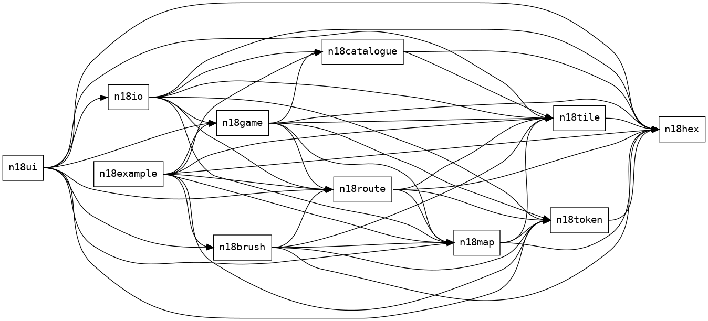

# Documentation to-do list

The documentation for each module needs to be fleshed out with
introductory text and examples, and more detailed documentation for
individual types and functions.
See the [Rust documentation guidelines](https://rust-lang.github.io/api-guidelines/documentation.html) for details.

## README.md for each crate

Each crate should have a `README.md` file.

- Add shields for the license, the crate on `crates.io`, the documentation on `docs.rs`, and perhaps a link to the `rusty_train` book.

- Briefly describe the crate, and refer the reader to `navig18xx` and `rusty_train` for more details.

- Add the `License` and `Contribution` sections from the top-level `README.md`.

## Document public items

Identify public items that are missing documentation by running:

```sh
cargo clippy --all-targets -- -W missing_docs
```

For reference, see [this list of allowed-by-default lints](https://doc.rust-lang.org/rustc/lints/listing/allowed-by-default.html).

## Architecture diagram

We currently generate a dependency graph:



But perhaps we can convey further details with an architecture diagram.
For example, SQLite has a great [architecture document](https://sqlite.org/arch.html) that includes a very clear diagram.

## Examples of crate documentation

The [csv crate](https://github.com/BurntSushi/rust-csv/) has excellent documentation, including a [tutorial](https://docs.rs/csv/*/csv/tutorial/index.html) and a [cookbook](https://docs.rs/csv/*/csv/cookbook/index.html).

## Hosting on docs.rs

See the [docs.rs documentation](https://docs.rs/about) for information about the documentation is generated.
