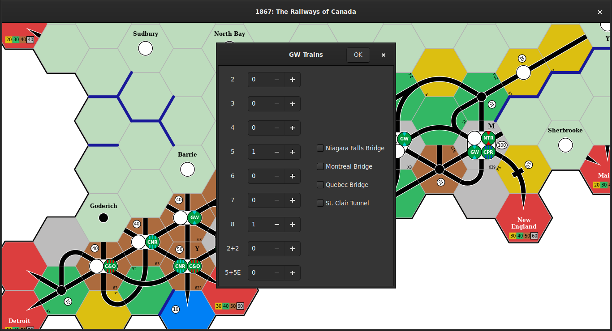

# Example

Start Rusty Train with `cargo run --release`:

Load the `1867_bc` example game, which is in `./examples/output/1867_bc.game`, with `Ctrl+O`:

Press `r` to find the optimal routes for a company.
Select the **Great Western Railway** and click `OK`:

This company owns a `5-train` and an `8-train`, and does not receive any of the four bonuses listed on the right-hand side.
Enter these details and click `OK`:

The map is disabled and faded out while searching for the optimal routes:

When the optimal routes are found, they will be drawn on the map (highlighted in green and in red) and the net revenue is shown in the window title:

Use the arrow keys (`<Left>`, `<Right>`, `<Up>`, `<Down>`) to cycle through the individual routes; the train name and route revenue are shown in the window title:

Press `Esc` or `Return` to return to the [**Default**](default.md) mode.
