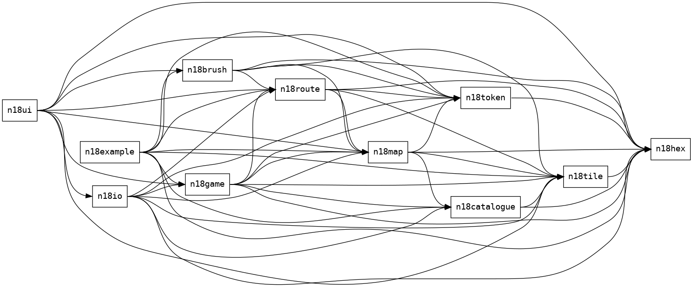

## Architecture diagram

We currently generate a dependency graph:

But perhaps we can convey further details with an architecture diagram.
For example, SQLite has a great [architecture document](https://sqlite.org/arch.html) that includes a very clear diagram.
